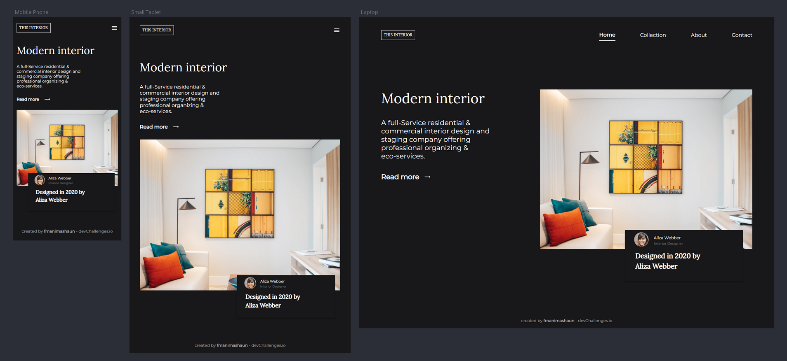
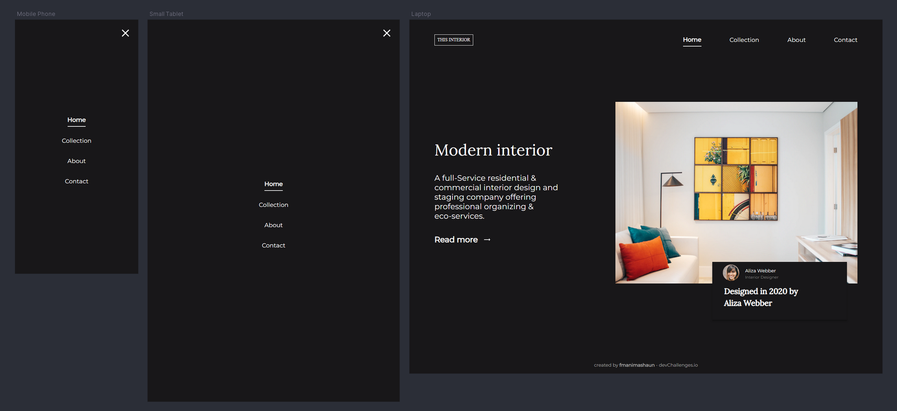

<!-- Please update value in the {}  -->

<h1 align="center">Interior Consultant Homepage</h1>

   Solution for a challenge from  <a href="http://devchallenges.io" target="_blank">Devchallenges.io</a>.

  <h3>
    <a href="https://fmanimashaun.com/projects/devchallenges.io/interior-consultant-challenge/">
      Demo
    </a>
     | 
    <a href="https://github.com/fmanimashaun/Personal-Portfolio/tree/main/Main/Projects/devchallenges.io/interior-consultant-challenge">
      Solution
    </a>
     | 
    <a href="https://devchallenges.io/challenges/Jymh2b2FyebRTUljkNcb">
      Challenge
    </a>
  </h3>

<!-- TABLE OF CONTENTS -->

## Table of Contents

- [Overview](#overview)
  - [Built With](#built-with)
- [Features](#features)
- [Contact](#contact)
- [Acknowledgements](#acknowledgements)

<!-- OVERVIEW -->

## Overview
### Showing full site

### Showing mobile menu

This challenge was undertaken to further strengthen my understanding of basic HTML and CSS with consideration for a responsive design using algorithm layout concepts.

- The live demo can be seen [here](https://fmanimashaun.com/projects/devchallenges.io/interior-consultant-challenge/)
- So far, I believe can say I am getting good with reading UI/UX design on Figma and implementing the design using HTML/CSS/Javascript
- I feel there is still a lot to learn and understand with respect to the layout but there was a lot of improvement with this particular challenge with the use of custom modular scale and responsive design

### Built With

<!-- This section should list any major frameworks that you built your project using. Here are a few examples.-->

- [HTML](https://developer.mozilla.org/en-US/docs/Web/HTML)
- [CSS](https://developer.mozilla.org/en-US/docs/Web/CSS)
- [JavaScript](https://developer.mozilla.org/en-US/docs/Web/JavaScript)
- [Algorithm Layout](https://every-layout.dev/)

## Features

<!-- List the features of your application or follow the template. Don't share the Figma file here :) -->

This application/site was created as a submission to a [DevChallenges](https://devchallenges.io/challenges) challenge. The [challenge](https://devchallenges.io/challenges/Jymh2b2FyebRTUljkNcb) was to build an application to complete the given user stories.

## Acknowledgements

<!-- This section should list any articles or add-ons/plugins that help you to complete the project. This is optional but it will help you in the future. For example -->
- [Marked - a markdown parser](https://github.com/chjj/marked)

## Contact

- Website [LinkedIn profile](https://www.linkedin.com/in/fmanimashaun/)
- GitHub [@fmanimashaun](https://{github.com/your-usermame})
- Twitter [@fmanimashaun](https://twitter.com/fmanimashaun)
