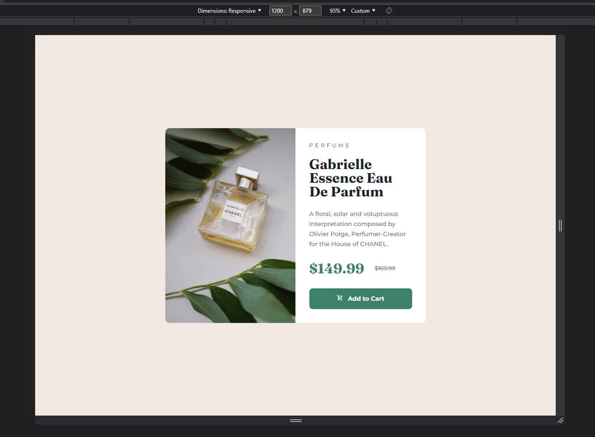
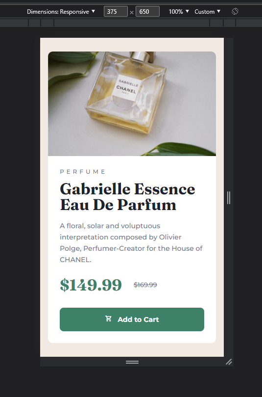

# Welcome! 👋
## Frontend Mentor - Product preview card component solution

This is a solution to the [Product preview card component challenge on Frontend Mentor](https://www.frontendmentor.io/challenges/product-preview-card-component-GO7UmttRfa). Frontend Mentor challenges help you improve your coding skills by building realistic projects. 

## Table of contents

- [Overview](#overview)
  - [The challenge](#the-challenge)
  - [Screenshot](#screenshot)
  - [Links](#links)
- [My process](#my-process)
  - [Built with](#built-with)
  - [What I learned](#what-i-learned)
  - [Continued development](#continued-development)
  - [Useful resources](#useful-resources)
- [Author](#author)
- [Acknowledgments](#acknowledgments)


## Overview

### The challenge

Users should be able to:

- View the optimal layout depending on their device's screen size
- See hover and focus states for interactive elements

### Screenshot
#### Desktop view


#### Mobile view


### Links

- Solution URL: [Click here](https://github.com/fmanimashaun/frontend-mentor-challenge/tree/main/product-preview-card-component)
- Live Site URL: [Click here](https://fmanimashaun.github.io/frontend-mentor-challenge/product-preview-card-component/main/index.html)

## My process

### Built with

- Semantic HTML5 markup
- CSS
- Flexbox
- CSS Grid
- Mobile-first workflow


### What I learned

I was able to demonstrate the use of flexbox and grid layout while at the same time using media-query as shown below:
````
@media only screen and (max-width: 600px) {

    }
   
````

### Continued development

I still have a lot to learn on layout using flexbox and grid and I will be focusing more responsive web design for future projects

### Useful resources

------

## Author

- Website - [Personal site under development](https://fmanimashaun.com)
- Frontend Mentor - [@fmanimashaun](https://www.frontendmentor.io/profile/fmanimashaun)
- Twitter - [@fmanimashaun](https://twitter.com/fmanimashaun)


## Acknowledgments
